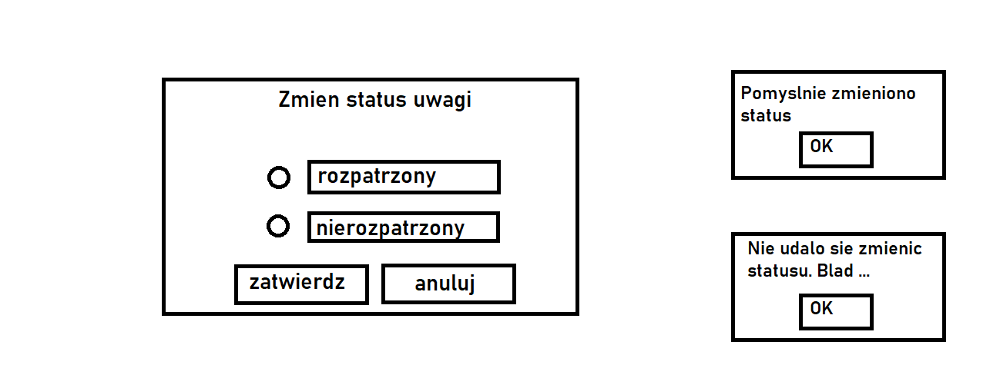
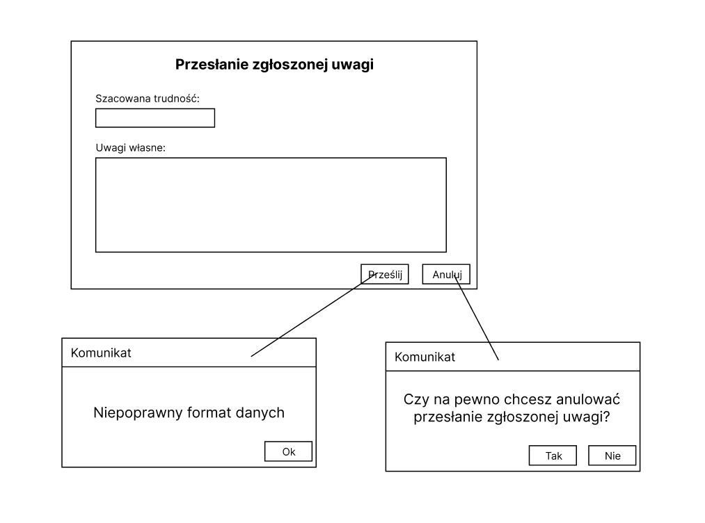

# Scenariusze oraz scenopisy przypadków użycia

## PU017 Wyświetlenie szczegółów zgłoszonej uwagi - Kornelia Kołodziejska

## PU018 Zmiana statusu zgłoszonej uwagi do zbioru - Jakub Klenkiewicz

**SCENARIUSZ GŁÓWNY**

PRE : - Okno szczegółów uwagi do zbioru zostało poprawnie wyświetlone

1. Zarządca danych klika na przycisk “zmień”
2. System wyświetla formularz zmiany statusu uwagi do zbioru
3. Zarządca danych wybiera status uwagi do zbioru (rozpatrzona/nierozpatrzona)
4. Zarządca danych naciska przycisk zatwierdź
5. System aktualizuje status uwagi do zbioru
6. System zapisuje informacje o zmianie statusu uwagi do zbioru do historii działań
7. System wyświetla okno pomyślnej zmiany statusu uwagi do zbioru
8. Zarządca danych naciska przycisk ok

final : success

POST : Status uwagi do zbioru danych został zmieniony na pożądany, oraz zmiana ta została zapisana do historii działań

**SCENARIUSZ ALTERNATYWNY 1 (niepowodzenie połączenia z bazą danych)**

1.-4. tak jak w scenariuszu głównym

5a). System niepomyślnie próbuje połączyć się z bazą danych zawierającą status uwagi

6a). System wyświetla okno niepomyślnej zmiany statusu uwagi do zbioru wraz z powodem

7a). Zarządca danych naciska przycisk ok

final : failure

POST : Status uwagi do zbioru danych nie został zaktualizowany

**SCENARIUSZ ALTERNATYWNY 2 (anulowanie)**

1.-2. tak jak w scenariuszu głównym

3b) Zarządca danych naciska przycisk "anuluj"

4b) System zamyka formularz zmiany statusu uwagi do zbioru.

final**:** canceled
POST**:** Status uwagi do zbioru danych nie został zmieniony. Żadna informacja nie została zapisana do historii działań.

**Postulaty o zmiany w słowniku dziedziny**

- Dodać status uwagi jako atrybut uwagi do zbioru danych → enum : rozpatrzona/nierozpatrzona

**Poglądowy widok okien**

## PU038 Przesłanie zgłoszonej uwagi do zarządcy danych - Łukasz Gumienniczuk

**SCENARIUSZ GŁÓWNY:**

PRE: Weryfikator jest zalogowany, Weryfikator ma uprawnienia do zarządzania zgłoszeniami, Weryfikator wybrał zgłoszoną uwagę

1. Weryfikator wybiera opcję "prześlij zgłoszenie uwagi".
2. System wyświetla formularz przesłania zgłoszonej uwagi.
3. Weryfikator wpisuje dodatkowe informacje uwagi.
4. Weryfikator wybiera opcję "prześlij".
5. System waliduje dodatkowe informacje uwagi.
    
    [Dane poprawne]

    6a. System zapisuje dodatkowe informacje uwagi.

    7a. System zmienia status zgłoszonej uwagi na "zweryfikowana".

    8a. Ssytem wyświetla komunikat o poprawnym przesłaniu zgłoszonej uwagi.
    
Final: success

Post: Zgłoszona uwaga została przesłana do zarządcy danych.

**SCENARIUSZ ALTERNATYWNY: [Dane niepoprawne]**

1-5. tak jak w scenariuszu głównym
        
6b. System wyświetla komunikat o niepoprawnych danych.

7b. Weryfikator wybiera opcję "ok".

Powrót do zdania 3. w scenariuszu głownym.

**SCENARIUSZ ALTERNATYWNY: [Anulowanie]**

1-3. tak jak w scenariuszu głownym

4b. Weryfikator wybiera opcję "anuluj".

5b. System wyświetla okno potwierdzenia anulowania przesłania zgłoszonej uwagi.

6b. Weryfikator wybiera opcję "ok".

Final: Failed

POST: Anulowano przesłanie zgłoszenia uwagi; nic nie zostało zmodyfikowane.

_**Dodano 'Dodatkowe Infromacje uwagi' do słownika dziedziny**_

