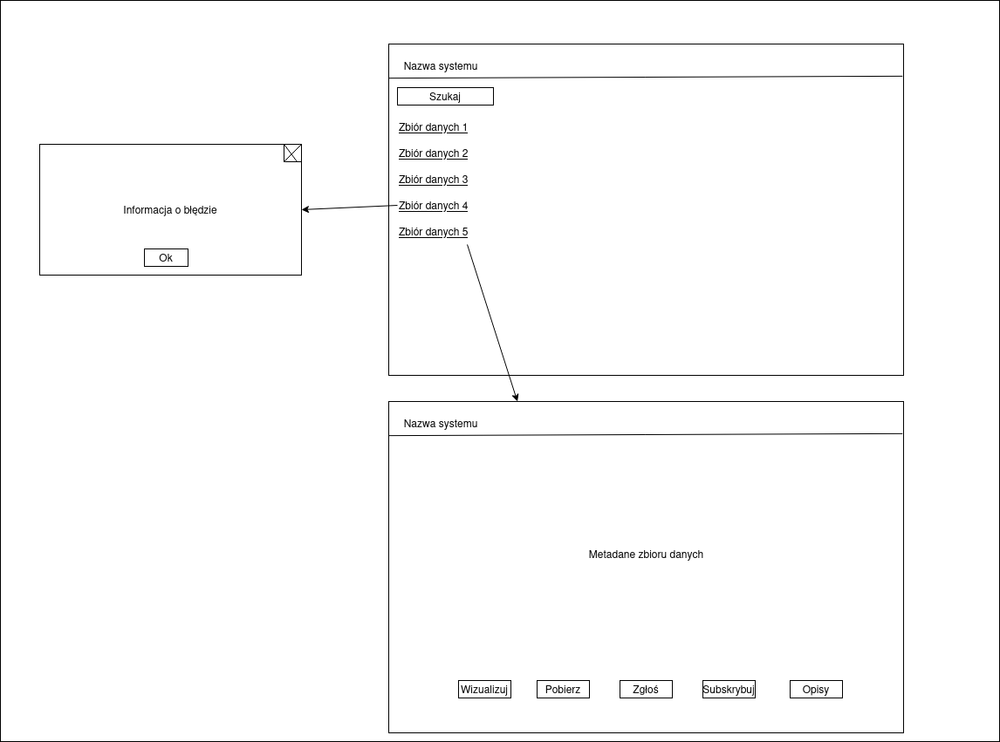

# Scenariusze oraz scenopisy przypadków użycia

## PU001 Logowanie do systemu - Michał Bibrzycki

**SCENARIUSZ GŁÓWNY**

PRE: Użytkownik jest niezalogowany i jest zarejestrowany w sustemie oraz zna swoje <u>dane logowania</u>

1. Użytkownik wybiera opcję "zaloguj się"
2. System wyświetla formularz logowania
3. Użytkownik wprowadza <u>dane logowania</u>
4. Użytkownik wybiera opcję "zaloguj".  
[poprawny dostęp Systemu do bazy danych]
5. System waliduje <u>dane logowania</u>  
[<u>dane logowania</u> poprawne]
6. System zmienia stan użytkownika na zalogowany
7. System wyświetla menu ekranu głównego  
final: success

POST: Użytkonik jest zalogowany

**SCENARIUSZ ALTERNATYWNY 1**

1.-4. tak jak w SCENARIUSZU GŁÓWNYM  
[brak dostępu Systemu do bazy danych]  
5a. System wyświetla informację "Wystąpił błąd systemu, spróbuj ponownie później"  
final : failure

POST: Użytkonik jest niezalogowany

**SCENARIUSZ ALTERNATYWNY 2**

1.-5. tak jak w SCENARIUSZU GŁÓWNYM  
[<u>dane logowania</u> niepoprawne]  
6b. System wyświetla informację "Niepoprawne dane logowania"  
final : failure

POST: Użytkonik jest niezalogowany

**Brak zmian w słowniku dziedziny**

**Poglądowy widok okien**

## PU003 Wyświetlenie szczegółów danych - Mikołaj Tradecki

**SCENARIUSZ GŁÓWNY**

PRE : Użytkownik znajduje się w ekranie listy zbiorów danych.

1. Użytkownik wybiera zbiór danych z listy
2. System pobiera metadane zbioru danych 
   [Poprawne połączenie z bazą danych]
3. System wyświetla ekran szczogółów zbiorów danych.

\<\<invoke\>\> [Wyświetlenie wizualizacji zbioru danych]   
\<\<invoke\>\> [Pobranie dystrybucji zbioru danych]  
\<\<invoke\>\> [Zgłoszenie uwagi do zbioru danych]  
\<\<invoke\>\> [Zasubskrybowanie zbioru danych]  
\<\<invoke\>\> [Wygenerowanie opisów bibliograficznych]   
final: success  
POST: Stan się nie zmienia   

**SCENARIUSZ ALTERNATYWNY 1**  
1-2 Tak jak w scenariuszu głównym.   
3a. System wyświetla komunikato o błędzie połączenia  
4a. Użytkownik wybiera przycisk zamknij  
final: failure  
POST: Stan się nie zmienia.  

=======
## PU014 Edytowanie zbioru danych - Michał Jagodziński

**SCENARIUSZ GŁÓWNY**

PRE : - Zarządca danych jest zalogowany, lista zbiorów danych jest wyświetlona

1. Zarządca danych wybiera konkretny zbiór danych z listy zbiorów danych
2. System pobira dane zbioru danych
3. System wyświetla okno zbioru danych
4. Zarządca danych naciska guzik "edycja"
5. System wyświetla formularz edycji danych zbioru danych
6. Zarządca danych edytuje dane zbioru dancyh
   [Zatwierdzenie]
7. System waliduje nowe dane zbioru danych
   [Dane poprawne]
8. System wyświelta komunikat "sukces"
   
final : success

POST : Zmodyfikowane dane zbioru danych zapisane w systemie

**SCENARIUSZ ALTERNATYWNY 1 (Anulowanie)**

1.-6. tak jak w scenariuszu głównym

7a). Powrót do punktu nr 3.

final : canceled

POST : Dane zbioru danych nie zostały zmodyfikowane

**SCENARIUSZ ALTERNATYWNY 2 (Dane niepoprawne)**

1.-7. tak jak w scenariuszu głównym

8b) System wyświelta komunikat niepowodzenie

final : failure
POST : Dane zbioru danych nie zostały zmodyfikowane

**Postulaty o zmiany w słowniku dziedziny**

Brak

**Poglądowy widok okien**

## PU017 Wyświetlenie szczegółów zgłoszonej uwagi - Kornelia Kołodziejska

**SCENARIUSZ GŁÓWNY**

PRE : -Zarządca danych jest zalogowany

1. Zarządca danych wybiera opcję "wyświetl szczegóły zgłoszonej uwagi".
2. System pobiera szczegóły zgłoszonej uwagi. [dane pobrane prawidłowo].
3. System wyświetla szczegóły uwagi.

POST : Stan systemu bez zmian

**SCENARIUSZ ALTERNATYWNY 1 (błąd pobrania danych)**

PRE : -Zarządca danych jest zalogowany

1. Zarządca danych wybiera opcję "wyświetl szczegóły zgłoszonej uwagi".
2. System pobiera szczegóły zgłoszonej uwagi. [dane pobrane nieprawidłowo]
3. System wyświetla okno komunikatu "Błąd pobrania danych".

POST : Stan systemu bez zmian

**Zmiany w słowniku dziedziny**

Szczegóły zgłoszonej uwagi: Zawierają datę, nazwę użytkownika, status uwagi, treść uwagi, nazwę zbioru, którego dotyczy uwaga.

**Scenopisy do przypadku użycia**

## PU018 Zmiana statusu zgłoszonej uwagi do zbioru - Jakub Klenkiewicz

**SCENARIUSZ GŁÓWNY**

PRE : - Okno szczegółów uwagi do zbioru zostało poprawnie wyświetlone

1. Zarządca danych klika na przycisk “zmień”
2. System wyświetla formularz zmiany statusu uwagi do zbioru
3. Zarządca danych wybiera status uwagi do zbioru (rozpatrzona/nierozpatrzona)
4. Zarządca danych naciska przycisk zatwierdź
5. System aktualizuje status uwagi do zbioru
6. System zapisuje informacje o zmianie statusu uwagi do zbioru do historii działań
7. System wyświetla okno pomyślnej zmiany statusu uwagi do zbioru
8. Zarządca danych naciska przycisk ok

final : success

POST : Status uwagi do zbioru danych został zmieniony na pożądany, oraz zmiana ta została zapisana do historii działań

**SCENARIUSZ ALTERNATYWNY 1 (niepowodzenie połączenia z bazą danych)**

1.-4. tak jak w scenariuszu głównym

5a). System niepomyślnie próbuje połączyć się z bazą danych zawierającą status uwagi

6a). System wyświetla okno niepomyślnej zmiany statusu uwagi do zbioru wraz z powodem

7a). Zarządca danych naciska przycisk ok

final : failure

POST : Status uwagi do zbioru danych nie został zaktualizowany

**SCENARIUSZ ALTERNATYWNY 2 (anulowanie)**

1.-2. tak jak w scenariuszu głównym

3b) Zarządca danych naciska przycisk "anuluj"

4b) System zamyka formularz zmiany statusu uwagi do zbioru.

final**:** canceled
POST**:** Status uwagi do zbioru danych nie został zmieniony. Żadna informacja nie została zapisana do historii działań.

**Postulaty o zmiany w słowniku dziedziny**

- Dodać status uwagi jako atrybut uwagi do zbioru danych → enum : rozpatrzona/nierozpatrzona

**Poglądowy widok okien**

## PU038 Przesłanie zgłoszonej uwagi do zarządcy danych - Łukasz Gumienniczuk

**SCENARIUSZ GŁÓWNY:**

PRE: Weryfikator jest zalogowany, Weryfikator ma uprawnienia do zarządzania zgłoszeniami, Weryfikator wybrał zgłoszoną uwagę

1. Weryfikator wybiera opcję "prześlij zgłoszenie uwagi".
2. System wyświetla formularz przesłania zgłoszonej uwagi.
3. Weryfikator wpisuje dodatkowe informacje uwagi.
4. Weryfikator wybiera opcję "prześlij".
5. System waliduje dodatkowe informacje uwagi.
    
    [Dane poprawne]

    6a. System zapisuje dodatkowe informacje uwagi.

    7a. System zmienia status zgłoszonej uwagi na "zweryfikowana".

    8a. Ssytem wyświetla komunikat o poprawnym przesłaniu zgłoszonej uwagi.
    
Final: success

Post: Zgłoszona uwaga została przesłana do zarządcy danych.

**SCENARIUSZ ALTERNATYWNY: [Dane niepoprawne]**

1-5. tak jak w scenariuszu głównym
        
6b. System wyświetla komunikat o niepoprawnych danych.

7b. Weryfikator wybiera opcję "ok".

Powrót do zdania 3. w scenariuszu głownym.

**SCENARIUSZ ALTERNATYWNY: [Anulowanie]**

1-3. tak jak w scenariuszu głownym

4b. Weryfikator wybiera opcję "anuluj".

5b. System wyświetla okno potwierdzenia anulowania przesłania zgłoszonej uwagi.

6b. Weryfikator wybiera opcję "ok".

Final: Failed

POST: Anulowano przesłanie zgłoszenia uwagi; nic nie zostało zmodyfikowane.

_**Dodano 'Dodatkowe Infromacje uwagi' do słownika dziedziny**_

