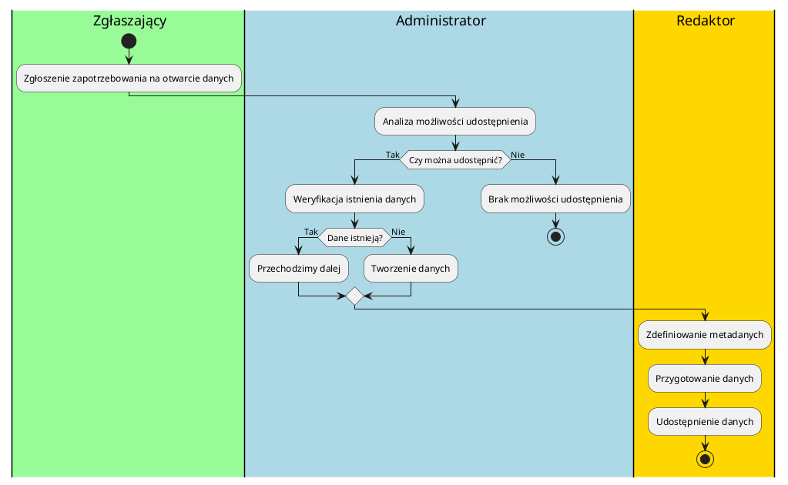
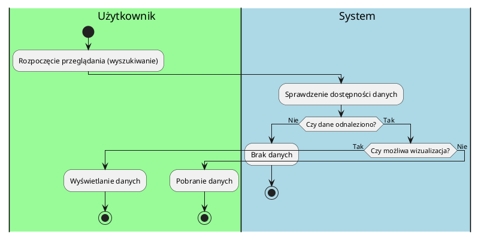
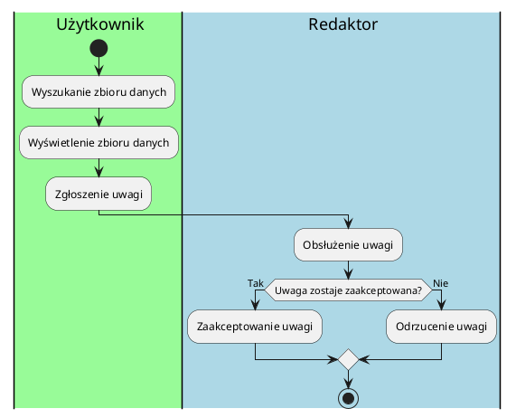
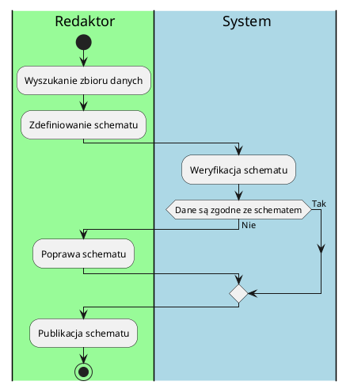
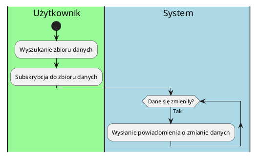
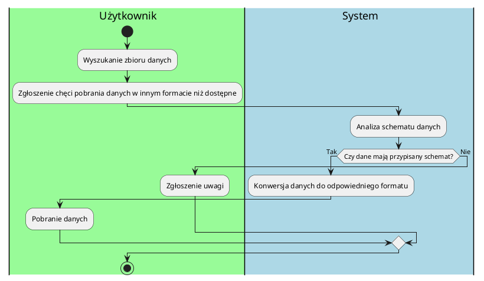

# Dokumentacja

## Opis biznesu

### Wstawianie danych do systemu

#### Opis

1. Zgłoszenie zapotrzebowania na otwarcie danych

- Rola: Zgłaszający
- Opis: Zgłaszający zgłasza zapotrzebowanie na udostępnienie danych.
- Kolor: `#palegreen`

2. Analiza możliwości udostępnienia

- Rola: Administrator
- Opis: Administrator w oparciu o wcześniej zdefiniowane kryteria decyduje o tym czy dane tego typu można udostępnić. Jeżeli nie to proces się kończy.
- Kolor `#lightblue`

3. Weryfikacja istnienia danych

- Rola: Administrator
- Opis: Administrator sprawdza czy istnieje źródło, które udostępnia takie dane.
- Kolor: `#lightblue`
  3a. Tworzenie danych
- Rola: Administrator
- Opis: Administrator zaleca zebranie odpowiednich danych.
- Kolor: `#lightblue`

4. Zdefiniowanie metadanych

- Rola: Redaktor
- Opis: Redaktor definiuje zestaw metadanych opisujących dodawany zbiór.
- Kolor: `#gold`

5. Przygotowanie danych

- Rola: Redaktor
- Opis: Redaktor przygotowuje dane do udostępnienia, to może obejmować np. ich odpowiednie zformatowanie lub przeredagowanie.
- Kolor: `#gold`

6. Udostępnienie danych

- Rola: Redaktor
- Opis: Redaktor udostępnia dane w serwisie.
- Kolor: `#gold`1. Zgłoszenie

#### Diagram



### Przeglądanie danych

#### Opis

1. Rozpoczęcie przeglądania (wyszukiwanie)

- Rola: Użytkownik
- Opis: Użytkownik wybiera zbiór danych poprzez wyszukanie go lub z zewnętrznego linku.
- Kolor: `#palegreen`

2. Sprawdzenie dostępności danych

- Rola: System
- Opis: System sprawdza dostępność danych. Jeżeli danych nieodnaleziono następuje koniec procesu.
- Kolor: `#lightblue`

3. Wyświetlenie danych

- Rola: Użytkownik
- Opis: Jeżeli wizualizacja jest możliwa, system wyświetla dane użytkownikowi w postaci np. diagramu bądź tabelki:
- Kolor: `#palegreen`

3. Pobranie danych

- Rola: Użytkownik
- Opis: Jeżeli wizualizacja nie jest dostępna użytkownik pobiera dane np. w postaci plików csv.
- Kolor: #palegreen

#### Diagram



### Zgłaszanie uwag

#### Opis

1. Otworzenie zbioru danych

- Rola: Użytkownik
- Opis: Użytkownik otwiera zbiór danych
- Kolor: `#palegreen`

2. Zgłoszenie uwagi

- Rola: Użytkownik
- Opis: Użytkownik zgłasza uwagę
- Kolor: `#palegreen`

3. Obsłużenie uwagi

- Rola: Redaktor
- Opis: Redaktor decyduje, czy zgłoszenie tyczy się zbioru danych i czy ma jakiś wpływ na zgloszone obiekcje.
- Kolor: `#lightblue`

3. Zaakceptowanie uwagi
   - Rola: Redaktor
   - Opis: Redaktor zgłasza problem do administracji.
   - Kolor: `#lightblue`
4. Odrzucenie uwagi
   - Rola: Redaktor
   - Opis: Redaktor odrzuca uwagę i nie podejmuje dalszych kroków.
   - Kolor: #lightblue

#### Diagram



### Zarządzanie schematami danych

#### Opis

1. Wyszukanie zbioru danych
   - Rola: Redaktor
   - Opis: Wyszukanie zbioru danych w celu zarządzania jego schematem danych.
   - Kolor: #palegreen
2. Zdefiniowanie schematu
   - Rola: Redaktor
   - Opis: Definiowanie struktury danych, włączając typy danych, ograniczenia i relacje pomiędzy elementami danych.
   - Kolor: #palegreen
3. Weryfikacja schematu
   - Rola: System
   - Opis: Automatyczna walidacja zbiorów danych względem przypisanych schematów w celu identyfikacji rozbieżności i błędów.
   - Kolor: #lightblue
   1. Poprawa schematu
      - Rola: Redaktor
      - Opis: Redaktor identyfikuje dane, które nie są zgodne ze schematem i wprowadza odpowiednie modyfikacje.
      - Kolor: #lightblue
4. Publikacja schematu
   - Rola: Redaktor
   - Opis: Udostępnianie schematów użytkownikom i systemom, które potrzebują zrozumieć strukturę zbiorów danych.
   - Kolor: #palegreen

#### Diagram



### Subskrybcja do powiadomień o zmianie danych

#### Opis

1. Wyszukanie zbioru danych
   - Rola: Użytkownik
   - Opis: Użytkownik wyszukuje zbioru danych w celu zasubskrybowania do powiadomień o zmianie danych.
   - Kolor: #palegreen
2. Subskrybcja do zbioru danych
   - Rola: Użytkownik
   - Opis: Użytkownik zapisuje się na powiadomienia dotyczące wybranego zbioru danych, aby otrzymywać informacje o jego aktualizacjach.
   - Kolor: #palegreen
3. Wysłanie powiadomienia o zmianie danych.
   - Rola: System
   - Opis: System automatycznie wysyła powiadomienie do subskrybentów w momencie wykrycia zmiany w subskrybowanym zbiorze danych.
   - Kolor: #lightblue

#### Diagram



### Konwersja formatu danych

#### Opis

1. Wyszukanie zbioru danych
   - Rola: Użytkownik
   - Opis: Użytkownik wyszukuje zbioru danych w celu pobrania danych.
   - Kolor: #palegreen
2. Zgłoszenie chęci pobrania danych w innym formacie niż dostępne.
   - Rola: Użytkownik
   - Opis: Użytkownik chce pobrać dane w przekonwertowanym formacie.
   - Kolor: #palegreen
3. Analiza schematu danych

   - Rola: System
   - Opis: System sprawdza strukturę i zgodność zbioru danych, żeby umożliwić ewentualną konwersję.
   - Kolor: #lightblue

   1. Zgłoszenie uwagi

      - Rola: Użytkownik
      - Opis: Użytkownik zgłasza uwagi dotyczące danych, np. brak schematu.
      - Kolor: #palegreen

   1. Konwersja danych do odpowiedniego formatu
      - Rola: System
      - Opis: System automatycznie przekształca dane do formatu wskazanego przez użytkownika, jeśli konwersja jest możliwa.
      - Kolor: #lightblue
   1. Pobranie danych
      - Rola: Użytkownik
      - Opis: Użytkownik pobiera dane w wybranym formacie.
      - Kolor: #palegreen

#### Diagram



## Wizja systemu

### 1. Abstrakt

Niniejszy dokument przedstawia wizję systemu zarządzania otwartymi danymi publicznymi, który odpowiada na istotny problem utrudnionego dostępu, przetwarzania i udostępniania informacji publicznej. Projektowany system zapewni efektywne zarządzanie oraz dynamiczne publikowanie danych pochodzących od administracji publicznej, co przyczyni się do poprawy ich jakości, aktualności oraz przejrzystości. W dokumencie wyszczególniono wymagania funkcjonalne oraz jakościowe systemu, uwzględniające kluczowe potrzeby wszystkich zidentyfikowanych interesariuszy. Zaproponowano również motto projektu: **„Otwarte dane – otwarte możliwości”** które ma skutecznie wspierać kampanie promocyjne, budować świadomość społeczną oraz wzmacniać poczucie zaangażowania zespołu projektowego.

### 2. Problem

#### 2.1 Istota problemu

Główny problem klienta polega na braku efektywnego systemu do zarządzania otwartymi danymi publicznymi, co utrudnia dostęp do informacji, ich przetwarzanie i udostępnianie. Powiązany jest z nim szereg innych, opisanych poniżej problemów.

#### 2.2 Specyfikacja problemów

- **(P0001) Brak efektywnego systemu do zarządzania otwartymi danymi publicznymi**

  **Priorytet: Kluczowy** | **Trudność: Średnia**

  **Opis:** Problem polega na braku spójnego, efektywnego systemu do zarządzania i udostępniania otwartych danych publicznych, który dotyczy przede wszystkim administracji publicznej, ale również obywateli, przedsiębiorców, analityków, organizacji pozarządowych oraz mediów. Rezultatem problemu są utrudnienia w dostępie do aktualnych, rzetelnych oraz kompletnych informacji publicznych, niska przejrzystość działań administracji oraz ograniczone możliwości efektywnego wykorzystania tych danych do tworzenia analiz, raportów czy rozwiązań innowacyjnych. Problem można rozwiązać poprzez stworzenie nowoczesnego systemu zarządzania otwartymi danymi publicznymi, który zapewni skuteczne zarządzanie, dynamiczne udostępnianie oraz intuicyjny dostęp do danych wraz z narzędziami analitycznymi i wizualizacyjnymi. Rozwiązanie tego problemu umożliwi łatwiejsze podejmowanie decyzji opartych o dane, zwiększy przejrzystość administracji publicznej, przyczyni się do wzrostu zaangażowania obywatelskiego oraz poprawi warunki do rozwoju społeczno-gospodarczego.

- **(P0002) Problem niedostatecznego wykorzystania danych publicznych**

  **Priorytet:** Wyoski | **Trudność:** Średnia

  **Opis:** Problem polega na niedostatecznym wykorzystaniu udostępnianych danych publicznych przez obywateli i przedsiębiorców, co podważa sensowność ponoszenia kosztów związanych z ich publikacją i utrzymaniem. Problem dotyczy administracji publicznej, obywateli oraz przedsiębiorców. Rezultatem jest niewystarczająca transparentność oraz niski zwrot z inwestycji w udostępnianie danych. Problem można rozwiązać, budując system oferujący dane w przystępnej formie, umożliwiający ich łatwą analizę, wizualizację oraz integrację. Korzyścią będzie zwiększenie zainteresowania danymi, większa transparentność działań administracji publicznej oraz tworzenie nowych innowacyjnych rozwiązań.

- **(P0003) Problem niskiej aktualności i wiarygodności danych**

  **Priorytet:** Kluczowy | **Trudność:** Średnia

  **Opis:** Problem dotyczy niskiej aktualności oraz wiarygodności udostępnianych danych publicznych, co ogranicza ich praktyczne zastosowanie. Problem ten dotyczy użytkowników danych (obywateli, przedsiębiorców, analityków). Jego rozwiązaniem jest budowa systemu z mechanizmami automatycznej aktualizacji, walidacji danych i śledzenia ich pochodzenia. Korzyścią będzie wzrost jakości i wiarygodności danych, a także ułatwienie podejmowania trafnych decyzji na podstawie tych danych.

- **(P0004) Problem integracji danych z innymi systemami**

  **Priorytet:** Kluczowy | **Trudność:** Wysoka

  **Opis:** Problem polega na trudnościach z integracją danych z zewnętrznymi systemami i aplikacjami, co ogranicza możliwości ponownego wykorzystania danych oraz innowacji. Dotyczy programistów, przedsiębiorców oraz analityków danych. Rozwiązaniem problemu jest wdrożenie jasnych standardów wymiany danych (np. CKAN, DCAT, RDF) oraz zapewnienie API umożliwiającego łatwą integrację. Korzyści wynikające z rozwiązania to zwiększenie interoperacyjności systemów, redukcja kosztów integracji oraz zwiększenie liczby aplikacji korzystających z danych publicznych.

- **(P0005) Brak narzędzi do analizy danych przez nietechnicznych użytkowników**

  **Priorytet:** Średni | **Trudność:** Średnia

  **Opis:** Problem dotyczy braku łatwych w użyciu narzędzi analitycznych, które pozwoliłyby użytkownikom bez specjalistycznej wiedzy technicznej samodzielnie eksplorować dane. Dotyka głównie obywateli, dziennikarzy, aktywistów i organizacje pozarządowe. Rozwiązaniem jest dostarczenie intuicyjnych narzędzi wizualizacyjnych (mapy, wykresy, raporty). Korzyści to zwiększenie samodzielności użytkowników, lepsze zrozumienie danych oraz ich szersze wykorzystanie społeczne.

- **(P0006) Brak jednolitej polityki otwierania danych publicznych**

  **Priorytet:** Wysoki | **Trudność:** Wysoka

  **Opis:** Problemem jest brak jednolitej polityki otwierania danych w administracji publicznej, co powoduje niejednolitość danych, ich słabą jakość oraz ograniczoną dostępność. Dotyczy to administracji publicznej, analityków, programistów oraz obywateli. Rozwiązaniem będzie wdrożenie spójnej polityki publikowania danych publicznych opartej na standardach jakości (DCAT, CKAN, RDF). Korzyścią jest zwiększenie dostępności i jakości danych, poprawa transparentności oraz wsparcie innowacyjności i rozwoju społeczno-gospodarczego.

- **(P0007) Niska świadomość społeczna na temat dostępnych danych**

  **Priorytet:** Średni | **Trudność:** Średnia

  **Opis:** Problem polega na niewystarczającej świadomości społecznej na temat korzyści płynących z otwartych danych publicznych. Dotyczy głównie obywateli i lokalnych społeczności. Rozwiązaniem jest kampania promocyjna oraz edukacyjna wprowadzona równolegle z systemem. Korzyści to wzrost świadomości społecznej, większe zainteresowanie danymi oraz poprawa jakości życia obywateli dzięki lepszemu wykorzystaniu dostępnych informacji publicznych.

- **(P0008) Trudność w zarządzaniu dużą ilością metadanych**

  **Priorytet:** Wysoki | **Trudność:** Średnia

  **Opis:** Problemem jest trudność zarządzania dużą ilością różnorodnych metadanych, co prowadzi do błędów, utrudnia wyszukiwanie danych i obniża jakość informacji. Rozwiązaniem jest wdrożenie intuicyjnych narzędzi do efektywnego zarządzania metadanymi zgodnymi ze standardem DCAT/AP. Korzyścią będzie usprawnienie zarządzania danymi, poprawa jakości ich dostępności oraz zwiększenie efektywności analizy informacji.

### 3. Motto

Motto projektu jest kluczowym elementem komunikacji, które wspiera kampanie promocyjne systemu, buduje świadomość społeczną oraz łatwo zapada w pamięć. Dodatkowo powinno inspirować, motywować oraz wzmacniać morale zespołu projektowego, budując ich poczucie przynależności i zaangażowanie we wspólne cele.

Proponujemy motto główne projektu

### Otwarte dane - otwarte możliwości

Pozostałe pomysły brane pod uwagę przy wyborze motto:

- „Otwarte dane. Wiedza, która zmienia świat.”

- „Otwórz dane, otwórz przyszłość.”

- „Otwarte dane – Twoje prawo do wiedzy.”

- „Dane publiczne – siła w transparentności.”

- „Dostęp do wiedzy kluczem do rozwoju.”

- „Otwórz się na dane, a dane otworzą się na Ciebie.”

- „Dane otwarte zmieniają rzeczywistość.”

### 4. Interesariusze

Tworzony system zarządzania publicznymi danymi otwartymi musi odpowiadać na potrzeby różnych grup interesariuszy. Poniżej przedstawiono szczegółową charakterystykę interesariuszy oraz określono kluczowe interesy każdej z grup.

#### 4.1 Administrator systemu

_Osoba lub grupa osób odpowiedzialna za bieżące zarządzanie, konfigurowanie i monitorowanie systemu._

**Kluczowe interesy:**

- Sprawne i wygodne zarządzanie systemem oraz zgromadzonymi zasobami danych.

- Intuicyjne narzędzia administracyjne umożliwiające efektywną kontrolę dostępu oraz zarządzanie użytkownikami.

- Łatwość monitorowania stanu systemu, diagnostyka problemów oraz szybkie reagowanie na awarie.

#### 4.2 Użytkownicy końcowi

_Osoby, które będą bezpośrednio korzystać z danych dostępnych w systemie (obywatele, badacze, studenci, dziennikarze, aktywiści społeczni, analitycy danych, firmy komercyjne)._

**Kluczowe interesy:**

- Łatwy i szybki dostęp do aktualnych, rzetelnych oraz wiarygodnych danych publicznych.

- Intuicyjny i responsywny interfejs umożliwiający efektywne wyszukiwanie, filtrowanie oraz wizualizację danych.

- Możliwość eksportu danych do wybranego formatu.

- Możliwość korzystania z danych anonimowo, bez konieczności logowania.

- Możliwość subskrypcji i otrzymywania powiadomień o aktualizacjach interesujących danych.

#### 4.3 Klienci organizacji

_Podmioty gospodarcze lub osoby fizyczne, które współpracują lub korzystają z usług organizacji dostarczającej dane._

**Kluczowe interesy:**

- Dostęp do otwartych danych umożliwiających realizację celów biznesowych, naukowych, edukacyjnych lub społecznych.

- Możliwość integracji danych publicznych ze swoimi własnymi systemami informatycznymi poprzez wygodne API.

- Gwarancja wysokiej jakości oraz aktualności udostępnianych danych.

#### 4.4 Inwestorzy i sponsorzy

_Podmioty finansujące projekt oraz oczekujące pozytywnego wpływu inwestycji na społeczeństwo lub gospodarkę lokalną._

**Kluczowe interesy:**

- Efektywne wykorzystanie środków publicznych przeznaczonych na realizację projektu.

- Transparentność projektu, wysoka jakość danych oraz zgodność systemu ze standardami krajowymi i międzynarodowymi.

- Poprawa wizerunku oraz zwiększenie zaufania obywateli wobec instytucji publicznych.

#### 4.5 Zamawiający

_Osoby podejmujące decyzje strategiczne związane z wdrożeniem systemu._

**Kluczowe interesy:**

- Wdrożenie systemu, który rozwiązuje kluczowe problemy administracji publicznej oraz wpisuje się w długoterminowe cele strategiczne jednostki.

- Możliwość łatwej weryfikacji efektywności systemu oraz jakości udostępnianych danych.

- Realizacja celów politycznych, społecznych oraz strategicznych poprzez wdrożenie skutecznego systemu danych otwartych.

#### 4.6 Dział IT

_Osoby odpowiedzialne za utrzymanie, rozwój techniczny oraz administrację infrastruktury informatycznej obsługującej system._

**Kluczowe interesy:**

- System stabilny, niezawodny i łatwy w utrzymaniu.

- Wykorzystanie nowoczesnych, bezpiecznych, dobrze udokumentowanych i aktywnie wspieranych technologii.

- Łatwa diagnostyka, monitoring oraz automatyzacja procesów związanych z zarządzaniem systemem.

- Zapewnienie skalowalności, bezpieczeństwa oraz ciągłej aktualizacji systemu.

#### 4.7 Partnerzy i integratorzy danych

_Zewnętrzne organizacje i instytucje dostarczające dane lub współpracujące z systemem na zasadzie integracji lub wymiany danych._

**Kluczowe interesy:**

- Wygodne mechanizmy integracji oraz automatyzacji transferu danych pomiędzy różnymi systemami.

- Jasno określone standardy wymiany danych (np. DCAT, CKAN, RDF).

- Szybka walidacja oraz możliwość błyskawicznego publikowania aktualizacji danych po stronie platformy.

#### 4.8 Analitycy i eksperci ds. danych

_Osoby zajmujące się analizą danych oraz ich wykorzystaniem do tworzenia raportów, analiz lub prognoz (badacze, specjaliści ds. urbanistyki, transportu, jakości powietrza itp.)._

**Kluczowe interesy:**

- Możliwość zaawansowanego wyszukiwania, filtrowania oraz eksportowania dużych zbiorów danych.

- Dostęp do narzędzi umożliwiających analizę oraz wizualizację danych (w tym predykcje i analizy za pomocą rozwiązań AI).

- Łatwe cytowanie oraz generowanie poprawnych opisów bibliograficznych do publikacji naukowych.

#### 4.9 Społeczność lokalna (obywatele)

_Mieszkańcy oraz społeczność lokalna, którzy mają bezpośredni lub pośredni wpływ na wykorzystanie danych publicznych._

**Kluczowe interesy:**

- Przejrzystość działania administracji oraz dostęp do aktualnych informacji (np. transport publiczny, zanieczyszczenie powietrza).

- Możliwość zgłaszania opinii oraz uwag dotyczących jakości danych lub ich prezentacji.

- Uzyskanie wymiernych korzyści społecznych i poprawa jakości życia dzięki efektywnemu wykorzystaniu danych.

### 5. Cechy systemu

#### 5.1 Cechy funkcjonalne

- **(CF0001) Rejestracja i zarządzanie użytkownikami**

  **Priorytet:** Kluczowy | **Trudność**: Średnia

  **Opis**:  
  System musi umożliwiać rejestrację nowych użytkowników oraz zarządzanie ich kontami przez administratora.

- **(CF0002) Anonimowy dostęp do danych publicznych (bez logowania)**

  **Priorytet:** Kluczowy | **Trudność**: Niska

  **Opis**:  
  System musi zapewnić użytkownikom możliwość dostępu do publicznych zbiorów danych bez konieczności logowania.

- **(CF0003) Import i eksport danych zgodny ze schematami (CSV, XML, JSON)**

  **Priorytet:** Kluczowy | **Trudność**: Średnia

  **Opis**:  
  System musi umożliwiać importowanie oraz eksportowanie danych zgodnie ze zdefiniowanymi schematami, obsługując formaty CSV, XML oraz JSON.

- **(CF0004) Pobieranie danych z zewnętrznych źródeł/API**

  **Priorytet:** Kluczowy | **Trudność**: Średnia

  **Opis**:  
  System musi umożliwiać automatyczne pobieranie danych z zewnętrznych źródeł (pliki, urządzenia pomiarowe, API) oraz ich dalszą integrację.

- **(CF0005) Automatyczna walidacja danych zgodnie z DCAT/AP**

  **Priorytet:** Kluczowy | **Trudność**: Wysoka

  **Opis**:  
  System musi automatycznie walidować importowane dane według standardu DCAT/AP, zapewniając ich spójność oraz zgodność.

- **(CF0006) Zgodność z piątym poziomem otwartości danych (RDF)**

  **Priorytet:** Kluczowy | **Trudność**: Wysoka

  **Opis**:  
  System musi zapewniać dostępność danych na piątym poziomie otwartości według klasyfikacji 5-star (standard RDF).

- **(CF0007) Dynamiczne udostępnianie danych poprzez API**

  **Priorytet:** Kluczowy | **Trudność**: Średnia

  **Opis**:  
   System musi umożliwiać dynamiczne, automatyczne udostępnianie zbiorów danych publicznych poprzez interfejs API.

- **(CF0008) Udostępnianie różnych dystrybucji tego samego zbioru danych**

  **Priorytet:** Kluczowy | **Trudność**: Średnia

  **Opis**:  
   System musi umożliwiać udostępnianie tego samego zbioru danych w różnych dystrybucjach.

- **(CF0009) Wersjonowanie danych**

  **Priorytet:** Wysoki | **Trudność**: Średnia

  **Opis**:  
   System musi zapewniać mechanizm wersjonowania danych z możliwością dostępu do ich wcześniejszych wersji.

- **(CF0010) Obsługa schematów danych (przypisywanie, walidacja, zarządzanie)**

  **Priorytet:** Kluczowy | **Trudność**: Wysoka

  **Opis**:  
   System musi umożliwiać zarządzanie, przypisywanie oraz walidację schematów danych dla konkretnych zbiorów.

- **(CF0011) Zaawansowane wyszukiwanie i filtrowanie zbiorów danych po wielu zmiennych**

  **Priorytet:** Kluczowy | **Trudność**: Średnia

  **Opis**:  
   System musi oferować zaawansowane mechanizmy wyszukiwania i filtrowania zbiorów danych według wielu różnych kryteriów.

- **(CF0012) Stronicowanie wyników wyszukiwania**

  **Priorytet:** Wysoki | **Trudność**: Niska

  **Opis**:  
   System musi umożliwiać stronicowanie wyników wyszukiwania, zapewniając przejrzystość prezentowanych danych.

- **(CF0013) Generowanie tabel z funkcją filtrowania i sortowania danych**

  **Priorytet:** Kluczowy | **Trudność**: Średnia

  **Opis**:  
   System musi umożliwiać prezentację danych w postaci tabelarycznej z opcją filtrowania i sortowania.

- **(CF0014) Interaktywne wizualizacje danych**

  **Priorytet:** Kluczowy | **Trudność**: Wysoka

  **Opis**:  
   System musi oferować możliwość interaktywnej wizualizacji danych, m.in. w formie wykresów oraz map. Zbiory danych powinny być oznaczane w odpowiedni sposób, aby zostały zwizualizowane zgodnie z zapotrzebowaniem.

- **(CF0015) Łatwe cytowanie danych i generowanie bibliografii**

  **Priorytet:** Średni | **Trudność**: Średnia

  **Opis**:  
   System musi umożliwiać użytkownikom łatwe cytowanie danych oraz automatyczne generowanie opisów bibliograficznych zgodnych z przyjętymi standardami.

- **(CF0016) Zarządzanie metadanymi zbiorów (standard DCAT/AP)**

  **Priorytet:** Kluczowy | **Trudność**: Średnia

  **Opis**:  
   System musi umożliwiać zarządzanie metadanymi zbiorów danych zgodnie ze standardem DCAT/AP.  
   Mechanizm ma obejmować stworzenie i konfigurację własnych zestawów metadanych oraz możliwość eksportu i importu zestawów metadanych.  
   Metadane danego zbioru powinny być edytowane zgodnie z jego przypisanym zestawem.

- **(CF0017) Zgłaszanie uwag do zbiorów danych przez użytkowników**

  **Priorytet:** Wysoki | **Trudność**: Średnia

  **Opis**:  
   System musi zapewnić użytkownikom możliwość zgłaszania uwag dotyczących jakości lub zawartości zbiorów danych.

- **(CF0018) Mechanizm zarządzania zgłoszeniami użytkowników**

  **Priorytet:** Wysoki | **Trudność**: Średnia

  **Opis**:  
   System musi posiadać mechanizm zarządzania zgłoszeniami od użytkowników, umożliwiający ich dalszą analizę i eskalację – wysyłkę konieczności wprowadzenia zmian przez dostawcę zbioru danych, obsługę odpowiedzi od dostawcy, zmianę statusu zgłoszenia, wysyłkę komunikatu o akceptacji bądź odrzuceniu zgłoszenia do zgłaszającego.

- **(CF0019) Powiadomienia o aktualizacjach subskrybowanych danych**

  **Priorytet:** Średni | **Trudność**: Średnia

  **Opis**:  
   System musi umożliwiać użytkownikom otrzymywanie powiadomień o aktualizacjach wybranych zbiorów danych za pomocą różnych kanałów komunikacji (e-mail, SMS, w aplikacji).

- **(CF0020) Indeksowanie danych i pozycjonowanie w przeglądarce**

  **Priorytet:** Wysoki | **Trudność**: Średnia

  **Opis**:  
   System musi umożliwiać indeksowanie zbiorów danych przez wyszukiwarki, zapewniając lepsze ich pozycjonowanie.

- **(CF0021) Dwuskładnikowa autoryzacja**

  **Priorytet:** Wysoki | **Trudność**: Średnia

  **Opis**:  
   System musi zapewniać możliwość dwuskładnikowego uwierzytelniania użytkowników przy pomocy standardu OAuth2.0.

#### 5.1.1 Pomysły na przyszłość

- **(CFP0001) Odpłatne udostępnianie wybranych danych w modelu subskrypcyjnym**

  **Priorytet:** Pomysł | **Trudność**: Średnia

  **Opis**:  
   System powinien umożliwić administratorowi odpłatne udostępnianie wybranych zbiorów danych na zasadach subskrypcji.

- **(CFP0002) Zmiana motywu graficznego wizualizacji przez użytkownika**

  **Priorytet:** Pomysł | **Trudność**: Niska

  **Opis**:  
   System powinien umożliwić użytkownikowi końcowemu samodzielną zmianę motywu graficznego wizualizacji danych według własnych preferencji.

- **(CFP0003) Predykcje dla odpowiednio oznaczonych zbiorów danych (z szeregiem czasowym)**

  **Priorytet:** Pomysł | **Trudność**: Wysoka

  **Opis**:  
   System powinien umożliwiać analitykom i użytkownikom generowanie predykcji na podstawie zbiorów danych posiadających szereg czasowy, wykorzystując modele prognostyczne.

- **(CFP0004) Statystyki użycia/pobrań danych**

  **Priorytet:** Pomysł | **Trudność**: Średnia

  **Opis**:  
   System powinien automatycznie gromadzić i prezentować statystyki dotyczące popularności i częstotliwości pobrań lub użycia danych przez użytkowników.

- **(CFP0005) Generowanie raportów użytecznych dla audytorów danych**

  **Priorytet:** Pomysł | **Trudność**: Średnia

  **Opis**:  
   System powinien umożliwić generowanie raportów zawierających informacje przydatne dla audytorów, takie jak historia zmian danych, ich źródło oraz jakość metadanych.

- **(CFP0006) Reklamy**

  **Priorytet:** Pomysł | **Trudność**: Niska

  **Opis**:  
   System powinien umożliwiać administratorowi zarządzanie i wyświetlanie reklam.

- **(CFP0007) Captcha**

  **Priorytet:** Pomysł | **Trudność**: Niska

  **Opis**:  
   System powinien oferować możliwość zabezpieczenia wybranych funkcjonalności (np. rejestracja, formularze kontaktowe) mechanizmem Captcha, chroniąc przed spamem i botami.

- **(CFP0008) Dostęp offline do wybranych danych**

  **Priorytet:** Pomysł | **Trudność**: Wysoka

  **Opis**:  
   System powinien umożliwiać użytkownikom dostęp do wybranych zbiorów danych w trybie offline, np. poprzez aplikację mobilną lub pobranie danych na urządzenie lokalne.

- **(CFP0009) Integracja z ChatGPT lub innymi rozwiązaniami AI**

  **Priorytet:** Pomysł | **Trudność**: Wysoka

  **Opis**:  
   System powinien wspierać integrację z modelami sztucznej inteligencji, takimi jak ChatGPT, umożliwiając użytkownikom prowadzenie interaktywnych analiz oraz generowanie wniosków na podstawie danych.

#### 5.2 Cechy jakościowe

- **(CJU0001) Intuicyjny i łatwy w obsłudze interfejs użytkownika**

  **Typ**: Użyteczność | **Priorytet**: Kluczowy | **Trudność**: Średnia

  **Opis**:  
   System powinien posiadać intuicyjny interfejs użytkownika, zapewniający szybkie opanowanie obsługi i łatwe wykonywanie podstawowych operacji.

  **Metryka**:  
   Średni wynik w skali SUS (System Usability Scale) powyżej 70 punktów, uzyskany od reprezentatywnej grupy użytkowników.

  **Sposób pomiaru**:  
   Ankieta SUS przeprowadzona po zakończeniu sesji testowej z użytkownikami.

  **Możliwe wyniki pomiaru**:  
   Wynik w skali SUS (0-100).

  **Akceptowalne wartości pomiaru**:  
   Powyżej 70 punktów.

- **(CJU0002) Responsywny interfejs**

  **Typ**: Użyteczność | **Priorytet**: Kluczowy | **Trudność**: Średnia

  **Opis**:  
   System powinien dostosowywać interfejs użytkownika do urządzeń mobilnych, tabletów i desktopów, zapewniając optymalny wygląd i obsługę.

  **Metryka**:  
   Czas ładowania interfejsu (mobile).

  **Sposób pomiaru**:  
   Testy responsywności (narzędzia Lighthouse, GTmetrix).

  **Możliwe wyniki pomiaru**:  
   W sekundach.

  **Akceptowalne wartości pomiaru**:  
   ≤3 sekundy w sieci 3G.

- **(CJU0003) Dostępność zgodna z WCAG 2.1 (AA)**

  **Typ**: Użyteczność | **Priorytet**: Kluczowy | **Trudność**: Wysoka

  **Opis**:  
   System musi spełniać standard WCAG 2.1 na poziomie AA, zapewniając dostępność dla osób z niepełnosprawnościami.

  **Metryka**:  
   Procent spełnionych kryteriów WCAG 2.1 AA.

  **Sposób pomiaru**:  
   Audyt dostępności (narzędzia automatyczne oraz audyt ekspercki).

  **Możliwe wyniki pomiaru**:  
   0–100%.

  **Akceptowalne wartości pomiaru**:  
   100% zgodności z poziomem AA.

- **(CJN0001) Dostępność systemu 24/7 (SLA 99,9%)**

  **Typ**: Niezawodność | **Priorytet**: Kluczowy | **Trudność**: Wysoka

  **Opis**:  
   System musi być dostępny całodobowo przez 7 dni w tygodniu, z gwarantowanym poziomem dostępności SLA wynoszącym minimum 99,9%.

  **Metryka**:  
   Procentowa dostępność systemu (uptime).

  **Sposób pomiaru**:  
   Narzędzia monitorujące (np. UptimeRobot).

  **Możliwe wyniki pomiaru**:  
   0–100%.

  **Akceptowalne wartości pomiaru**:  
   ≥99,9% miesięcznie.

- **(CJN0002) Regularne backupy i szybkie odtwarzanie danych**

  **Typ**: Niezawodność | **Priorytet**: Kluczowy | **Trudność**: Średnia

  **Opis**:  
   System musi automatycznie tworzyć kopie zapasowe danych i umożliwiać szybkie odtworzenie danych po ewentualnej awarii.

  **Metryka**:  
   Czas odtworzenia danych (RTO) i częstotliwość backupów (RPO).

  **Sposób pomiaru**:  
   Testy przywracania danych.

  **Możliwe wyniki pomiaru**:  
   RTO: czas w godzinach; RPO: godziny pomiędzy kopiami.

  **Akceptowalne wartości pomiaru**:  
   RTO ≤2 godziny, RPO ≤24 godziny.

- **(CJB0001) Odporność na cyberataki**

  **Typ**: Bezpieczeństwo | **Priorytet**: Kluczowy | **Trudność**: Wysoka

  **Opis**:  
   System musi posiadać zabezpieczenia przed cyberatakami, zapewniając ochronę danych poprzez szyfrowanie, uwierzytelnianie oraz kontrolę dostępu.

  **Metryka**:  
   Wyniki audytu bezpieczeństwa.

  **Sposób pomiaru**:  
   Audyt ekspercki, testy penetracyjne.

  **Możliwe wyniki pomiaru**:  
   Liczba znalezionych zagrożeń.

  **Akceptowalne wartości pomiaru**:  
   Brak zagrożeń krytycznych/wysokich.

- **(CJW0001) Krótki czas odpowiedzi na zapytania**

  **Typ**: Efektywność wydajnościowa | **Priorytet**: Kluczowy | **Trudność**: Wysoka

  **Opis**:  
   System musi generować odpowiedzi na zapytania użytkowników (np. wyszukiwanie danych) w czasie krótszym niż 3 sekundy.

  **Metryka**:  
   Średni czas odpowiedzi serwera na zapytania użytkowników.

  **Sposób pomiaru**:  
   Automatyczne testy wydajnościowe, mierzone narzędziami do monitoringu serwera.

  **Możliwe wyniki pomiaru**:  
   Czas odpowiedzi (w sekundach).

  **Akceptowalne wartości pomiaru**:  
   Poniżej 3 sekund.

- **(CJW0002) Skalowalność systemu**

  **Typ**: Efektywność wydajnościowa | **Priorytet**: Kluczowy | **Trudność**: Wysoka

  **Opis**:  
   System musi efektywnie obsługiwać rosnącą liczbę użytkowników (do 100 000 jednoczesnych sesji) oraz dużą ilość danych (do 10 TB).

  **Metryka**:  
   Liczba równoczesnych użytkowników obsługiwanych przez system bez pogorszenia parametrów czasowych oraz ilość przetwarzanych danych.

  **Sposób pomiaru**:  
   Testy obciążeniowe symulujące do 100 000 jednoczesnych użytkowników oraz testy pojemności danych do 10 TB.

  **Możliwe wyniki pomiaru**:  
   Liczba jednoczesnych użytkowników, średni czas odpowiedzi systemu, wielkość obsługiwanych danych (TB).

  **Akceptowalne wartości pomiaru**:  
   Obsługa co najmniej 100 000 jednoczesnych użytkowników, czas odpowiedzi poniżej 3 sekund, obsługa co najmniej 10 TB danych.

- **(CJW0003) Wydajne przetwarzanie dużych zbiorów danych**

  **Typ**: Efektywność wydajnościowa | **Priorytet**: Kluczowy | **Trudność**: Wysoka

  **Opis**:  
   System musi szybko przetwarzać duże zbiory danych, np. importować 1 GB danych w czasie krótszym niż 15 minut.

  **Metryka**:  
   Czas importu dużych zbiorów danych (w minutach na GB).

  **Sposób pomiaru**:  
   Pomiar czasu importu dużych zbiorów danych przy użyciu automatycznych narzędzi.

  **Możliwe wyniki pomiaru**:  
   Czas potrzebny na przetworzenie/import 1 GB danych.

  **Akceptowalne wartości pomiaru**:  
   Mniej niż 15 minut na 1 GB danych.

- **(CJW0004) Minimalizacja zużycia zasobów serwera**

  **Typ**: Efektywność wydajnościowa | **Priorytet**: Niski | **Trudność**: Średnia

  **Opis**:  
   System powinien efektywnie wykorzystywać zasoby sprzętowe serwera, minimalizując zużycie procesora oraz pamięci RAM.

  **Metryka**:  
   Procentowe zużycie zasobów serwera (CPU, RAM) podczas typowego użytkowania systemu.

  **Sposób pomiaru**:  
   Monitoring serwera przy symulacji 50 000 jednoczesnych użytkowników za pomocą narzędzi diagnostycznych i monitorujących.

  **Możliwe wyniki pomiaru**:  
   Średnie obciążenie procesora (% CPU), średnie zużycie pamięci RAM (% RAM).

  **Akceptowalne wartości pomiaru**:  
   Zużycie CPU poniżej 50%, zużycie pamięci RAM poniżej 70%.

- **(CJM0001) Łatwa instalacja i konfiguracja**

  **Typ**: Łatwość utrzymania | **Priorytet**: Kluczowy | **Trudność**: Średnia

  **Opis**:  
   System powinien być łatwy w instalacji oraz konfiguracji na różnych platformach, nie przekraczając 10 kroków konfiguracyjnych oraz 2 godzin instalacji.

  **Metryka**:  
   Liczba kroków instalacji oraz całkowity czas instalacji na nowym środowisku.

  **Sposób pomiaru**:  
   Pomiar czasu oraz liczby kroków konfiguracyjnych podczas testowej instalacji systemu na nowych środowiskach.

  **Możliwe wyniki pomiaru**:  
   Liczba kroków instalacji (całkowita), czas instalacji (w godzinach i minutach).

  **Akceptowalne wartości pomiaru**:  
   Maksymalnie 10 kroków konfiguracyjnych, czas instalacji krótszy niż 2 godziny.

- **(CJM0002) Diagnostyka i monitoring stanu systemu**

  **Typ**: Łatwość utrzymania | **Priorytet**: Kluczowy | **Trudność**: Średnia

  **Opis**:  
   System powinien umożliwiać łatwe monitorowanie stanu, dostępności i szybkie diagnozowanie awarii.

  **Metryka**:  
   Średni czas potrzebny na identyfikację problemu od momentu jego wystąpienia oraz dostępność narzędzi diagnostycznych.

  **Sposób pomiaru**:  
   Pomiar czasu identyfikacji awarii podczas symulacji zdarzeń awaryjnych, weryfikacja dostępności narzędzi diagnostycznych 24/7.

  **Możliwe wyniki pomiaru**:  
   Czas diagnozy awarii (w minutach), dostępność narzędzi diagnostycznych (TAK/NIE).

  **Akceptowalne wartości pomiaru**:  
   Identyfikacja awarii poniżej 15 minut, narzędzia diagnostyczne dostępne 24/7.

- **(CJM0003) Łatwa testowalność**

  **Typ**: Łatwość utrzymania | **Priorytet**: Kluczowy | **Trudność**: Średnia

  **Opis**:  
   System musi być zaprojektowany tak, by umożliwiać skuteczne przeprowadzanie testów automatycznych i manualnych.

  **Metryka**:  
   Procent pokrycia kodu testami automatycznymi, czas wykonania pełnej serii testów automatycznych.

  **Sposób pomiaru**:  
   Analiza pokrycia kodu narzędziami automatycznym, pomiar czasu wykonania całego zestawu testów automatycznych.

  **Możliwe wyniki pomiaru**:  
   Pokrycie kodu (%), czas wykonania pełnego zestawu testów (w minutach).

  **Akceptowalne wartości pomiaru**:  
   Pokrycie kodu co najmniej 80%, czas wykonania pełnej serii testów poniżej 60 minut.

- **(CJP0001) Aplikacja webowa i mobilna**

  **Typ**: Przenośność | **Priorytet**: Kluczowy | **Trudność**: Wysoka

  **Opis**:  
   System musi być dostępny jako aplikacja webowa oraz aplikacja mobilna (Android, iOS), zapewniając co najmniej 80% funkcjonalności aplikacji webowej w aplikacji mobilnej.

  **Metryka**:  
   Procent pokrycia funkcjonalności aplikacji webowej przez aplikację mobilną oraz ocena aplikacji mobilnej w sklepach aplikacji.

  **Sposób pomiaru**:  
   Porównanie funkcjonalności aplikacji mobilnej względem aplikacji webowej oraz analiza średnich ocen użytkowników w Google Play i App Store.

  **Możliwe wyniki pomiaru**:  
   Pokrycie funkcjonalności (%), średnia ocena aplikacji mobilnej w sklepach (skala 1-5).

  **Akceptowalne wartości pomiaru**:  
   Co najmniej 80% funkcjonalności aplikacji webowej dostępne w aplikacji mobilnej, średnia ocena aplikacji minimum 4.0 w sklepach aplikacji.

- **(CJK0001) Kompatybilność z popularnymi przeglądarkami**

  **Typ**: Kompatybilność | **Priorytet**: Kluczowy | **Trudność**: Średnia

  **Opis**:  
   System musi być w pełni kompatybilny z najpopularniejszymi przeglądarkami internetowymi (Chrome, Firefox, Edge, Safari).

  **Metryka**:  
   Procent poprawnie wykonanych przypadków testowych kompatybilności w każdej przeglądarce.

  **Sposób pomiaru**:  
   Testy manualne oraz automatyczne w popularnych przeglądarkach, z wykorzystaniem narzędzi typu Selenium, Playwright.

  **Możliwe wyniki pomiaru**:  
   Procent zgodności dla każdej z wymienionych przeglądarek.

  **Akceptowalne wartości pomiaru**:  
   ≥ 95% poprawności dla każdej z wymienionych przeglądarek.

- **(CJN0003) Odporność na błędy użytkownika**

  **Typ**: Niezawodność | **Priorytet**: Niski | **Trudność**: Średnia

  **Opis**:  
   System powinien być odporny na typowe błędy użytkowników, minimalizując ryzyko awarii lub błędnych operacji.

  **Metryka**:  
   Liczba błędów krytycznych zgłoszonych podczas testów użytkowników.

  **Sposób pomiaru**:  
   Testy manualne oraz analiza zgłoszeń użytkowników podczas sesji testowych, ocena częstotliwości występowania błędów.

  **Możliwe wyniki pomiaru**:  
   Liczba błędów krytycznych na 100 wykonanych operacji użytkownika.

  **Akceptowalne wartości pomiaru**:  
   ≤ 2 błędy krytyczne na 100 operacji.

- **(CJB0003) Zgodność z wymaganiami RODO**

  **Typ**: Bezpieczeństwo | **Priorytet**: Kluczowy | **Trudność**: Wysoka

  **Opis**:  
   System musi spełniać wymagania dotyczące ochrony danych osobowych określone w RODO (GDPR).

  **Metryka**:  
   Procent zgodności z wymogami RODO po audycie prawnym i technicznym.

  **Sposób pomiaru**:  
   Audyt ekspercki zgodności prawnej i technicznej z RODO, analiza raportu zgodności.

  **Możliwe wyniki pomiaru**:  
   Procent spełnienia wymogów RODO, liczba wykrytych niezgodności.

  **Akceptowalne wartości pomiaru**:  
   100% spełnienie kluczowych wymagań RODO, brak niezgodności krytycznych.

- **(CJK0002) Kompatybilność z innymi systemami (integracja CKAN)**

  **Typ**: Kompatybilność | **Priorytet**: Kluczowy | **Trudność**: Wysoka

  **Opis**:  
   System musi zapewniać możliwość łatwej integracji z systemami zewnętrznymi, szczególnie z systemem CKAN, umożliwiając wymianę danych oraz ich metadanych.

  **Metryka**:  
   Liczba poprawnie zintegrowanych źródeł danych w ramach CKAN.

  **Sposób pomiaru**:  
   Testy integracyjne z wykorzystaniem API CKAN, weryfikacja zgodności formatów danych, walidacja metadanych.

  **Możliwe wyniki pomiaru**:  
   Liczba źródeł danych zintegrowanych bez błędów, procent poprawnej integracji.

  **Akceptowalne wartości pomiaru**:  
   ≥ 90% poprawnej integracji testowanych źródeł danych.

- **(CJP0002) Wsparcie wielojęzyczności**

  **Typ**: Przenośność | **Priorytet**: Średni | **Trudność**: Średnia

  **Opis**:  
   System powinien obsługiwać wiele wersji językowych interfejsu użytkownika oraz metadanych, umożliwiając dostęp dla użytkowników z różnych krajów.

  **Metryka**:  
   Liczba obsługiwanych języków.

  **Sposób pomiaru**:  
   Weryfikacja interfejsu i bazy metadanych.

  **Możliwe wyniki pomiaru**:  
   Liczba języków.

  **Akceptowalne wartości pomiaru**:  
   ≥3 języki.

- **(CJU0004) Łatwość nauki obsługi systemu**

  **Typ**: Użyteczność | **Priorytet**: Niski | **Trudność**: Średnia

  **Opis**:  
   System powinien być łatwy do opanowania przez nowych użytkowników, skracając czas potrzebny na rozpoczęcie korzystania z jego funkcji.

  **Metryka**:  
   Średni czas realizacji kluczowych zadań przez nowych użytkowników.

  **Sposób pomiaru**:  
   Pomiar czasu realizacji podczas testów użyteczności.

  **Możliwe wyniki pomiaru**:  
   Czas w minutach.

  **Akceptowalne wartości pomiaru**:  
   ≤30 minut.


### 6. Przypadki użycia

#### 6.1. Użytkownik
  **Diagram**

  ```puml
  @startuml Uzytkownik
  left to right direction

  actor "Użytkownik" as User

  usecase "PU001:\nLogowanie do systemu" as PU001
  usecase "PU002:\nWyświetlenie listy\nzbiorów danych" as PU002
  usecase "PU003:\nWyświetlenie szczegółów\nzbioru danych" as PU003
  usecase "PU004:\nWyświetlenie wizualizacji\nzbioru danych" as PU004
  usecase "PU005:\nZmienienie parametrów\nwizualizacji" as PU005
  usecase "PU006:\nPobranie dystrybucji\nzbioru danych" as PU006
  usecase "PU007:\nZgłoszenie uwagi\ndo zbioru danych" as PU007
  usecase "PU008:\nZasubskrybowanie\nzbioru danych" as PU008
  usecase "PU009:\nWygenerowanie opisów\nbibliograficznych" as PU009
  usecase "PU010:\nWyświetlenie listy\nzgłoszonych uwag" as PU010
  usecase "PU011:\nWyświetlenie szczegółów\nzgłoszenia" as PU011

  User --> PU001
  User --> PU002
  User --> PU010

  PU002 ..> PU003 : <<invoke>>
  PU003 ..> PU004 : <<invoke>>
  PU003 ..> PU007 : <<invoke>>
  PU003 ..> PU008 : <<invoke>>
  PU003 ..> PU006 : <<invoke>>
  PU003 ..> PU009 : <<invoke>>
  PU004 ..> PU005 : <<invoke>>

  PU010 ..> PU011 : <<invoke>>

  @enduml
  ```

  - **(PU001) Logowanie do systemu**

    **Waga:** Wysoka | **Trudność**: Średnia

    **Opis**:  
    Użytkownik wprowadza swoje dane uwierzytelniające, takie jak login i hasło, aby uzyskać dostęp do systemu. Po pomyślnym zalogowaniu zostaje przekierowany do ekranu głównego, gdzie ma dostęp do dostępnych funkcji.

  - **(PU002) Wyświetlenie listy zbiorów danych**

    **Waga:** Średnia | **Trudność**: Niska

    **Opis**:  
    Użytkownik przegląda katalog dostępnych zbiorów danych w formie listy zawierającej podstawowe informacje, takie jak nazwa, krótki opis i dostępne formaty. Dane są uporządkowane według określonych kryteriów, umożliwiając ich łatwe przeszukiwanie i filtrowanie.

  - **(PU003) Wyświetlenie szczegółów zbiorów danych**

    **Waga:** Średnia | **Trudność**: Niska

    **Opis**:  
    Użytkownik otwiera szczegółowy widok wybranego zbioru danych, w którym znajdują się informacje o jego strukturze, dostępnych formatach oraz metadanych. Może również zobaczyć historię aktualizacji oraz opcje pobrania lub subskrypcji.

  - **(PU004) Wyświetlenie wizualizacji zbioru danych**

    **Waga:** Średnia | **Trudność**: Niska 

    **Opis**:
    Użytkownik ogląda interaktywną wizualizację danych w postaci wykresów, tabel lub map, które przedstawiają kluczowe aspekty zbioru. Może korzystać z narzędzi do manipulacji danymi, np. zmiany zakresu wartości lub sposobu ich grupowania   
.
  - **(PU005) Zmienienie parametrów wizualizacji**

    **Waga:** Średnia | **Trudność**: Średnia 

    **Opis**:  
    Użytkownik dostosowuje sposób prezentacji danych, wybierając różne typy wizualizacji, zmieniając kolory, oś wartości lub filtrując wybrane kategorie. Zmiany są dynamicznie odzwierciedlane na ekranie, umożliwiając precyzyjną analizę danych.

  - **(PU006) Pobranie dystrybucji zbioru danych**

    **Waga:** Wysoka | **Trudność**: Średnia

    **Opis**:  
    Użytkownik wybiera format i metodę pobrania danych, a następnie inicjuje proces pobierania pliku na swoje urządzenie.

  - **(PU007) Zgłoszenie uwagi do zbioru danych**

    **Waga:** Średnia | **Trudność**: Niska

    **Opis**:  
    Użytkownik wypełnia formularz zgłoszeniowy, wpisując treść uwagi dotyczącej konkretnego zbioru danych, np. błędy w metadanych lub nieaktualne informacje. Zgłoszenie jest następnie przesyłane do weryfikatora systemu w celu weryfikacji.

  - **(PU008) Zasubskrybowanie zbioru danych**

    **Waga:** Wysoka | **Trudność**: Średnia

    **Opis**:  
    Użytkownik wybiera zbiór danych i aktywuje subskrypcję, aby otrzymywać powiadomienia o jego aktualizacjach. Może również określić preferencje dotyczące formy powiadomień (e-mail, powiadomienie systemowe itp.).

  - **(PU009) Wygenerowanie opisów bibliograficznych**

    **Waga:** Niska | **Trudność**: Niska

    **Opis**:  
    Użytkownik wybiera zbiór danych i generuje opis bibliograficzny zgodny z wybranym standardem cytowania (np. APA, MLA). Może pobrać opis w formacie tekstowym lub skopiować go do schowka.

  - **(PU010) Wyświetlenie listy zgłoszonych uwag**

    **Waga:** Średnia | **Trudność**: Niska

    **Opis**:  
    Użytkownik przegląda listę zgłoszonych uwag dotyczących zbiorów danych, zawierającą informacje takie jak treść, data dodania oraz status zgłoszenia. Uwagi są uporządkowane według kryteriów, np. daty dodania lub statusu przetwarzania.

  - **(PU011) Wyświetlenie szczegółów zgłoszenia**

    **Waga:** Średnia | **Trudność**: Niska 

    **Opis**:  
    Użytkownik otwiera szczegóły wybranego zgłoszenia, gdzie znajduje treść zgłoszonej uwagi, jej status oraz ewentualne odpowiedzi zarządcy danych. Może również zobaczyć historię działań związanych ze zgłoszeniem.
    

#### 6.2. Zarządca danych
  **Diagram**

  ```puml
  @startuml ZarzadcaDanych

  left to right direction

  actor "Zarządca danych" as Admin

  usecase "PU012:\nWyświetlenie listy\nzbiorów danych" as PU012
  usecase "PU013:\nDodanie\nzbioru danych" as PU013
  usecase "PU014:\nEdytowanie\nzbioru danych" as PU014
  usecase "PU015:\nUsunięcie\nzbioru danych" as PU015

  usecase "PU016:\nWyświetlenie zweryfikowanej\nlisty zgłoszonych uwag" as PU016
  usecase "PU017:\nWyświetlenie szczegółów\nzgłoszonej uwagi" as PU017
  usecase "PU018:\nZmiana statusu\nzgłoszenia" as PU018

  usecase "PU019:\nWyświetlenie listy\nschematów" as PU019
  usecase "PU020:\nDodanie schematu" as PU020
  usecase "PU021:\nEdytowanie schematu" as PU021
  usecase "PU022:\nUsunięcie schematu" as PU022

  Admin --> PU012
  PU012 ..> PU013 : <<invoke>>
  PU012 ..> PU014 : <<invoke>>
  PU012 ..> PU015 : <<invoke>>

  Admin --> PU016
  PU016 ..> PU017 : <<invoke>>
  PU017 ..> PU018 : <<invoke>>

  Admin --> PU019
  PU019 ..> PU020 : <<invoke>>
  PU019 ..> PU021 : <<invoke>>
  PU019 ..> PU022 : <<invoke>>

  @enduml
  ```

  - **(PU012) Wyświetlenie listy zbiorów danych**

    **Waga:** Średnia | **Trudność**: Niska

    **Opis**:    
    Zarządca danych przegląda katalog dostępnych zbiorów danych, zawierający informacje takie jak nazwa, opis, oraz format. Lista jest prezentowana w sposób umożliwiający szybkie wyszukiwanie i filtrowanie.

  - **(PU013) Dodanie zbioru danych**

    **Waga:** Wysoka  | **Trudność**: Średnia 

    **Opis**:  
    Zarządca danych rejestruje nowy zbiór, podając kluczowe informacje, takie jak nazwa, opis, format i powiązane schematy. Po zatwierdzeniu zbiór jest dostępny dla użytkowników systemu.

  - **(PU014) Edytowanie zbioru danych**

    **Waga:** Średnia | **Trudność**: Średnia

    **Opis**:  
    Zarządca danych aktualizuje istniejący zbiór, zmieniając jego metadane, formaty dystrybucji lub powiązane schematy. Edycja może wymagać ponownej weryfikacji poprawności danych.

  - **(PU015) Usunięcie zbioru danych**

    **Waga:** Wysoka | **Trudność**: Średnia

    **Opis**:  
    Zarządca danych usuwa zbiór danych z systemu.

  - **(PU016) Wyświetlenie zweryfikowanej listy zgłoszonych uwag**

    **Waga:** Średnia | **Trudność**: Niska

    **Opis**:  
    Zarządca danych przegląda listę uwag dotyczących zbiorów danych, które przeszły proces weryfikacji. Każda uwaga zawiera treść, datę zgłoszenia oraz status.

  - **(PU017) Wyświetlenie szczegółów zgłoszonej uwagi**

    **Waga:** Średnia | **Trudność**: Niska

    **Opis**:  
    Zarządca danych przegląda pełne informacje o konkretnej uwadze, w tym jej status oraz historię działań.

  - **(PU018) Zmiana statusu zgłoszenia**

    **Waga:** Średnia | **Trudność**: Średnia

    **Opis**:  
    Zarządca danych aktualizuje status zgłoszonej uwagi, np. oznaczając ją jako zaakceptowaną, odrzuconą lub wymagającą dodatkowej analizy. Każda zmiana jest rejestrowana w historii działań.

  - **(PU019) Wyświetlenie listy schematów**

    **Waga:** Średnia | **Trudność**: Niska

    **Opis**:  
    Zarządca danych przegląda dostępne schematy danych. Lista zawiera informacje o strukturze i formacie.
        
  - **(PU020) Dodanie schematu**

    **Waga:** Wysoka  | **Trudność**: Średnia

    **Opis**:  
    Zarządca danych tworzy nowy schemat, określając jego strukturę, typy danych i reguły walidacji.

  - **(PU021) Edytowanie schematu**

    **Waga:** Średnia | **Trudność**: Średnia

    **Opis**:  
    Zarządca danych aktualizuje istniejący schemat, modyfikując jego strukturę, dodając nowe pola lub zmieniając ich typy. Zmiany mogą wymagać dostosowania istniejących zbiorów danych.

  - **(PU022) Usunięcie schematu**

    **Waga:** Wysoka | **Trudność**: Średnia

    **Opis**:  
    Zarządca danych usuwa schemat z systemu, co może wymagać wcześniejszej weryfikacji, czy nie jest on powiązany z aktywnymi zbiorami. W razie potrzeby użytkownicy są informowani o konieczności migracji danych.

 
#### 6.3. Subskrybent
  **Diagram**

  ```puml
  @startuml Subskrybent
  left to right direction

  actor "Subskrybent" as U

  usecase "PU023:\nWyświetlenie listy\nsubskrypcji" as PU023
  usecase "PU024:\nEdytowanie ustawień\nsubskrypcji" as PU024
  usecase "PU003:\nWyświetlenie szczegółów\nzbioru danych" as PU003

  U --> PU023
  PU023 ..> PU024 : <<invoke>>
  PU023 ..> PU003 : <<invoke>>

  @enduml
  ```

  - **(PU023) Wyświetlenie listy subskrypcj**

    **Waga:** Średnia | **Trudność**: Niska

    **Opis**:  
    Subskrybent przegląda listę subskrybowanych zbiorów danych, która zawiera informacje takie jak nazwa zbioru, data subskrypcji oraz ustawienia powiadomień. Lista jest uporządkowana w sposób umożliwiający szybkie znalezienie interesujących pozycji.

  - **(PU024) Edytowanie ustawień subskrybcji**

    **Waga:** Średnia | **Trudność**: Niska

    **Opis**:  
    Subskrybent zmienia ustawienia subskrypcji, takie jak preferowany sposób otrzymywania informacji lub status aktywności subskrypcji. Wprowadzone zmiany są natychmiastowo zapisywane w systemie.


#### 6.4. Dostawca danych
  **Diagram**

  ```puml
  @startuml DostawcaDanych
  left to right direction

  actor "Dostawca danych" as Provider

  usecase "PU025:\nWyświetlenie listy\nprzypisanych zbiorów danych" as PU025
  usecase "PU026:\nDodanie dystrybucji" as PU026
  usecase "PU027:\nEdytowanie dystrybucji" as PU027
  usecase "PU028:\nUsunięcie dystrybucji" as PU028

  Provider --> PU025

  PU025 ..> PU026 : <<invoke>>
  PU025 ..> PU027 : <<invoke>>
  PU025 ..> PU028 : <<invoke>>

  @enduml
  ```

  - **(PU025) Wyświetlenie listy przypisanych zbiorów danych**

    **Waga:** Średnia | **Trudność**: Niska

    **Opis**:  
    Dostawca danych przegląda listę zbiorów, za które jest odpowiedzialny, wraz z informacjami o ich statusie, dacie ostatniej aktualizacji i liczbie powiązanych dystrybucji. Lista jest posortowana według określonych kryteriów dla ułatwienia zarządzania danymi.

  - **(PU026) Dodanie dystrybucji**

    **Waga:** Średnia | **Trudność**: Średnia 

    **Opis**:  
    Dostawca danych dodaje nową dystrybucję do istniejącego zbioru, określając jej format oraz ścieżkę dostępu. System automatycznie weryfikuje zgodność dystrybucji z wymaganiami przed jej opublikowaniem.

  - **(PU027) Edytowanie dystrybucji**

    **Waga:** Średnia | **Trudność**: Średnia

    **Opis**:  
    Dostawca danych aktualizuje istniejącą dystrybucję, zmieniając jej parametry, takie jak format, ścieżka dostępu, czy licencja. Po zapisaniu zmian system automatycznie aktualizuje informacje w bazie danych.

  - **(PU028) Usunięcie dystrybucji**

    **Waga:** Średnia | **Trudność**: Niska

    **Opis**:  
    Dostawca danych usuwa dystrybucję z przypisanego zbioru, co skutkuje jej natychmiastowym usunięciem z systemu. W przypadku aktywnych subskrybentów system może wysłać automatyczne powiadomienie o zmianie.


#### 6.5. Czas
  **Diagram**

  ```puml
  @startuml Czas
  left to right direction

  actor "Czas" as Time

  usecase "PU029:\nWysłanie powiadomienia\no zmianach w zbiorze danych\nsubskrybentom" as PU029
  usecase "PU030:\nWygenerowanie raportów\nczęstotliwości pobrań\nzbiorów danych" as PU030
  usecase "PU031:\nStworzenie backup'u" as PU031

  Time --> PU029
  Time --> PU030
  Time --> PU031

  @enduml
  ```

  - **(PU029) Wysłanie powiadomień o zmianach w zbiorze danych subskrybentom**

    **Waga:** Wysoka | **Trudność**: Średnia

    **Opis**:  
    System automatycznie wysyła powiadomienia do subskrybentów, informując ich o zmianach w subskrybowanych zbiorach danych, takich jak nowe wersje, dodane dystrybucje czy aktualizacje metadanych. Powiadomienia są dostarczane zgodnie z preferencjami użytkownika.

  - **(PU030) Wygenerowanie raportów częstotliwości pobrań zbiorów danych**

    **Waga:** Średnia | **Trudność**: Średnia

    **Opis**:  
    System okresowo generuje raporty prezentujące częstotliwość pobierania zbiorów danych przez użytkowników, z podziałem na okresy czasowe i typy dystrybucji. 

  - **(PU031) Stworzenie backup'u**

    **Waga:** Wysoka | **Trudność**: Wysoka

    **Opis**:  
    System automatycznie tworzy kopie zapasowe zbiorów danych oraz ich metadanych w określonych odstępach czasu. Backup jest przechowywany w zabezpieczonym repozytorium i może zostać przywrócony w przypadku awarii.


#### 6.6. Weryfikator
  **Diagram**

  ```puml
  @startuml Weryfikator
  left to right direction

  actor "Weryfikator" as Verifier

  usecase "PU032:\nWyświetlenie listy\nzmienionych zbiorów danych" as PU032
  usecase "PU033:\nWyświetlenie\nwprowadzonych zmian\nw zbiorze danych" as PU033
  usecase "PU034:\nZatwierdzenie\nwprowadzonych zmian\nw zbiorze danych" as PU034
  usecase "PU035:\nOdrzucenie\nwprowadzonych zmian\nw zbiorze danych" as PU035

  usecase "PU036:\nWyświetlenie listy\nzgłoszonych uwag" as PU036
  usecase "PU017:\nWyświetlenie szczegółów\nzgłoszonej uwagi" as PU017
  usecase "PU037:\nPrzesłanie uwagi\ndo zarządcy danych" as PU037
  usecase "PU038:\nOdrzucenie uwagi" as PU038

  usecase "PU039:\nWygenerowanie raportu\njakości danych" as PU039

  Verifier --> PU032
  Verifier --> PU036
  Verifier --> PU039

  PU032 ..> PU033 : <<invoke>>
  PU033 ..> PU034 : <<invoke>>
  PU033 ..> PU035 : <<invoke>>

  PU036 ..> PU017 : <<invoke>>
  PU017 ..> PU037 : <<invoke>>
  PU017 ..> PU038 : <<invoke>>

  @enduml
  ```
  - **(PU032) Wyświetlenie listy zbiorów danych**

    **Waga:** Średnia | **Trudność**: Niska

    **Opis**:    
    Weryfikator przegląda listę dostępnych zbiorów danych w systemie, zawierającą informacje takie jak nazwa, źródło oraz status weryfikacji. Zbiory mogą być filtrowane i sortowane według wybranych kryteriów.

  - **(PU033) Dodanie zbioru danych**

    **Waga:** Wysoka  | **Trudność**: Średnia

    **Opis**:  
    Weryfikator rejestruje nowy zbiór danych w systemie, wprowadzając jego nazwę, opis oraz źródło po wcześniejszej analizie jakości i zgodności z wytycznymi.

  - **(PU034) Edytowanie zbioru danych**

    **Waga:** Wysoka | **Trudność**: Wysoka

    **Opis**:  
    Weryfikator aktualizuje informacje o istniejącym zbiorze danych, zmieniając jego nazwę, opis lub inne parametry. Po wprowadzeniu zmian zbiór przechodzi ponowną weryfikację przed zatwierdzeniem.

  - **(PU035) Usunięcie zbioru danych**

    **Waga:** Wysoka  | **Trudność**: Niska

    **Opis**:  
    Weryfikator usuwa zbiór danych z systemu, jeśli nie spełnia on wymagań jakościowych lub zawiera błędy. Proces usuwania wymaga podania uzasadnienia decyzji przez Weryfikatora.

  - **(PU036) Wyświetlenie zweryfikowanej listy zgłoszonych uwag**

    **Waga:** Średnia | **Trudność**: Niska

    **Opis**:  
    Weryfikator przegląda listę zgłoszonych uwag dotyczących zbiorów danych, które zostały zweryfikowane pod kątem zasadności. Lista zawiera informacje takie jak treść uwagi, data zgłoszenia oraz status decyzji.

  - **(PU037) Wyświetlenie szczegółów zgłoszonej uwagi**

    **Waga:** Średnia | **Trudność**: Niska

    **Opis**:  
    Weryfikator otwiera szczegółowy widok zgłoszonej uwagi, w którym widoczna jest jej treść, data dodania oraz aktualny status. Możliwe jest także przejrzenie historii zmian statusu zgłoszenia.

  - **(PU038) Zmiana statusu zgłoszenia**

    **Waga:** Średnia | **Trudność**: Średnia

    **Opis**:  
    Weryfikator aktualizuje status zgłoszonej uwagi, wybierając spośród dostępnych opcji, takich jak „zaakceptowana”, „odrzucona” lub „wymaga dalszej analizy”. Zmiana statusu może być opatrzona uzasadnieniem.

  - **(PU039) Wygenerowanie raportu jakości danych**

    **Waga:** Średnia | **Trudność**: Średnia

    **Opis**:  
    Weryfikator tworzy raport podsumowujący jakość danych w systemie, zawierający statystyki dotyczące liczby zgłoszonych uwag, ich kategorii oraz procentu zatwierdzonych zmian. Raport może być zapisany w formacie PDF lub CSV.


#### 6.7. Administrator
  **Diagram**

  ```puml
  @startuml Administrator
  left to right direction

  actor "Administrator" as Admin

  usecase "PU040:\nWyświetlenie\nlogów systemu" as PU040
  usecase "PU041:\nWyświetlenie listy\nużytkowników" as PU041
  usecase "PU042:\nNadanie uprawnień\nużytkownikowi" as PU042
  usecase "PU043:\nDodanie konta\nużytkownika" as PU043
  usecase "PU044:\nEdytowanie konta\nużytkownika" as PU044
  usecase "PU045:\nUsunięcie konta\nużytkownika" as PU045
  usecase "PU046:\nZmienienie parametrów\nsystemu" as PU046

  Admin --> PU040
  Admin --> PU041
  Admin --> PU046

  PU041 ..> PU042 : <<invoke>>
  PU041 ..> PU043 : <<invoke>>
  PU041 ..> PU044 : <<invoke>>
  PU041 ..> PU045 : <<invoke>>

  @enduml
  ```
  - **(PU040) Wyświetlenie logów systemu**

    **Waga:** Wysoka | **Trudność**: Średnia

    **Opis**:  
    Administrator przegląda logi systemowe, które zawierają informacje o operacjach wykonywanych w systemie, błędach oraz innych zdarzeniach technicznych. Logi mogą być filtrowane według zakresu dat, typu zdarzenia i użytkownika.

  - **(PU041) Wyświetlenie listy użytkowników**

    **Waga:** Średnia | **Trudność**: Niska

    **Opis**:  
    Administrator przegląda listę aktywnych kont użytkowników wraz z ich danymi, takimi jak nazwa i rola. Możliwe jest sortowanie i wyszukiwanie użytkowników według wybranych kryteriów.

  - **(PU042) Nadanie uprawnień użytkownikowi**

    **Waga:** Wysoka | **Trudność**: Średnia

    **Opis**:  
    Administrator przypisuje użytkownikowi odpowiednie uprawnienia, wybierając z dostępnych ról i poziomów dostępu. Po zapisaniu zmian użytkownik może korzystać z dodatkowych funkcji systemu zgodnie z nadanymi uprawnieniami.
    
  - **(PU043) Dodanie konta użytkownika**

    **Waga:** Wysoka | **Trudność**: Średnia

    **Opis**:  
    Administrator tworzy nowe konto użytkownika, podając jego dane, takie jak imię, nazwisko, adres e-mail oraz przypisując odpowiednią rolę.

  - **(PU044) Edytowanie konta użytkownika**

    **Waga:** Średnia | **Trudność**: Niska

    **Opis**:  
    Administrator aktualizuje dane konta użytkownika, zmieniając informacje takie jak adres e-mail, imię i nazwisko lub przypisane role. Zmiany są od razu zapisywane i obowiązują przy kolejnym logowaniu użytkownika.

  - **(PU045) Usunięcie konta użytkownika**

    **Waga:** Średnia | **Trudność**: Niska

    **Opis**:  
    Administrator usuwa konto użytkownika z systemu, dezaktywując dostęp i usuwając powiązane dane zgodnie z polityką retencji. Usunięcie konta może wymagać potwierdzenia decyzji.
    
  - **(PU046) Zmienienie parametrów systemu**

    **Waga:** Wysoka | **Trudność**: Wysoka

    **Opis**:  
    Administrator konfiguruje kluczowe parametry systemu, takie jak ustawienia bezpieczeństwa, limity dostępu czy opcje integracji zewnętrznych.
