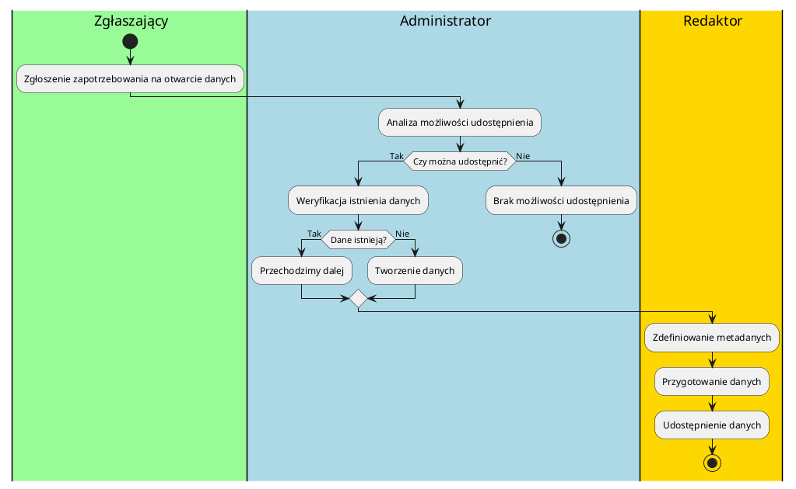
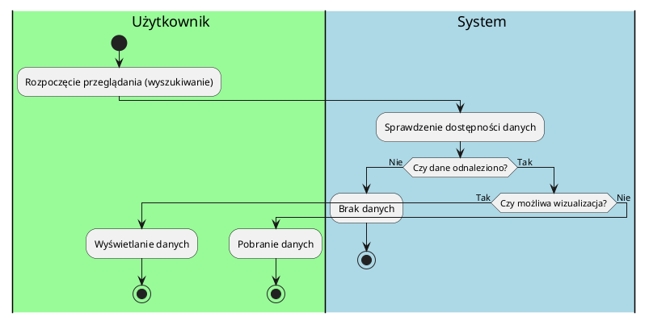
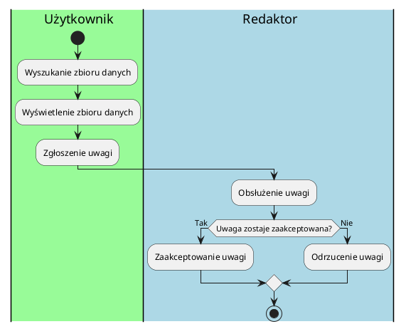
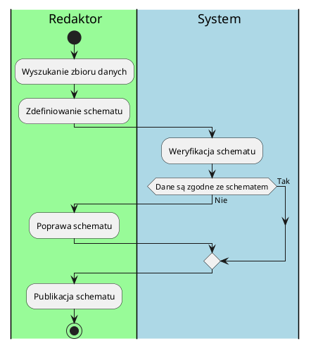
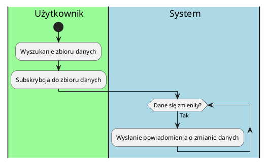
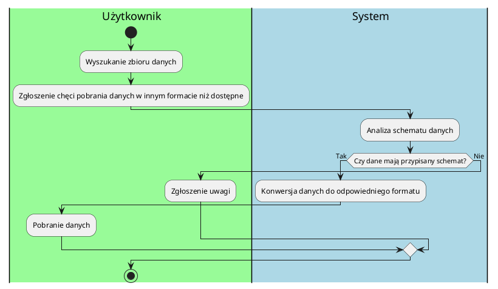

# Dokumentacja
## Opis biznesu
### Wstawianie danych do systemu
#### Opis
1. Zgłoszenie zapotrzebowania na otwarcie danych
  -   Rola: Zgłaszający
  -   Opis: Zgłaszający zgłasza zapotrzebowanie na udostępnienie danych.
  -   Kolor: `#palegreen`
2. Analiza możliwości udostępnienia
  -   Rola: Administrator
  -   Opis: Administrator w oparciu o wcześniej zdefiniowane kryteria decyduje o tym czy dane tego typu można udostępnić. Jeżeli nie to proces się kończy.
  -   Kolor `#lightblue`
3. Weryfikacja istnienia danych
  -   Rola: Administrator 
  -   Opis: Administrator sprawdza czy istnieje źródło, które udostępnia takie dane.
  -   Kolor: `#lightblue`
  3a. Tworzenie danych
    -   Rola: Administrator
    -   Opis: Administrator zaleca zebranie odpowiednich danych.
    -   Kolor: `#lightblue`
4. Zdefiniowanie metadanych
  -   Rola: Redaktor
  -   Opis: Redaktor definiuje zestaw metadanych opisujących dodawany zbiór.
  -   Kolor: `#gold`
5. Przygotowanie danych
  -   Rola: Redaktor
  -   Opis: Redaktor przygotowuje dane do udostępnienia, to może obejmować np. ich odpowiednie zformatowanie lub przeredagowanie.
  -   Kolor: `#gold`
6. Udostępnienie danych
  -   Rola: Redaktor
  -   Opis: Redaktor udostępnia dane w serwisie.
  -   Kolor: `#gold`1. Zgłoszenie 

#### Diagram

### Przeglądanie danych
#### Opis
1. Rozpoczęcie przeglądania (wyszukiwanie)
  -   Rola: Użytkownik
  -   Opis: Użytkownik wybiera zbiór danych poprzez wyszukanie go lub z zewnętrznego linku.
  -   Kolor: `#palegreen`
2. Sprawdzenie dostępności danych
  -   Rola: System
  -   Opis: System sprawdza dostępność danych. Jeżeli danych nieodnaleziono następuje koniec procesu.
  -   Kolor: `#lightblue`
3. Wyświetlenie danych
  -   Rola: Użytkownik 
  -   Opis: Jeżeli wizualizacja jest możliwa, system wyświetla dane użytkownikowi w postaci np. diagramu bądź tabelki:
  -   Kolor: `#palegreen`
3. Pobranie danych
  -   Rola: Użytkownik
  -   Opis: Jeżeli wizualizacja nie jest dostępna użytkownik pobiera dane np. w postaci plików csv.
  -   Kolor: #palegreen

#### Diagram

### Zgłaszanie uwag
#### Opis
1. Otworzenie zbioru danych
  -   Rola: Użytkownik
  -   Opis: Użytkownik otwiera zbiór danych
  -   Kolor: `#palegreen`
2. Zgłoszenie uwagi
  -   Rola: Użytkownik
  -   Opis: Użytkownik zgłasza uwagę
  -   Kolor: `#palegreen`
3. Obsłużenie uwagi 
  -   Rola: Redaktor
  -   Opis: Redaktor decyduje, czy zgłoszenie tyczy się zbioru danych i czy ma jakiś wpływ na zgloszone obiekcje.
  -   Kolor: `#lightblue`
3. Zaakceptowanie uwagi
    -   Rola: Redaktor
    -   Opis: Redaktor zgłasza problem do administracji.
    -   Kolor: `#lightblue`
3. Odrzucenie uwagi
    -   Rola: Redaktor
    -   Opis: Redaktor odrzuca uwagę i nie podejmuje dalszych kroków.
    -   Kolor: #lightblue

#### Diagram

### Zarządzanie schematami danych
#### Opis

1. Wyszukanie zbioru danych
    - Rola: Redaktor
    - Opis: Wyszukanie zbioru danych w celu zarządzania jego schematem danych.
    - Kolor: #palegreen
2. Zdefiniowanie schematu
    - Rola: Redaktor
    - Opis: Definiowanie struktury danych, włączając typy danych, ograniczenia i relacje pomiędzy elementami danych.
    - Kolor: #palegreen
3. Weryfikacja schematu
    - Rola: System
    - Opis: Automatyczna walidacja zbiorów danych względem przypisanych schematów w celu identyfikacji rozbieżności i błędów.
    - Kolor: #lightblue
    1. Poprawa schematu
        - Rola: Redaktor
        - Opis: Redaktor identyfikuje dane, które nie są zgodne ze schematem i wprowadza odpowiednie modyfikacje.
        - Kolor: #lightblue
4. Publikacja schematu
    - Rola: Redaktor
    - Opis: Udostępnianie schematów użytkownikom i systemom, które potrzebują zrozumieć strukturę zbiorów danych.
    - Kolor: #palegreen

#### Diagram

### Subskrybcja do powiadomień o zmianie danych
#### Opis
1. Wyszukanie zbioru danych
    - Rola: Użytkownik
    - Opis: Użytkownik wyszukuje zbioru danych w celu zasubskrybowania do powiadomień o zmianie danych.
    - Kolor: #palegreen
2. Subskrybcja do zbioru danych
    - Rola: Użytkownik
    - Opis: Użytkownik zapisuje się na powiadomienia dotyczące wybranego zbioru danych, aby otrzymywać informacje o jego aktualizacjach.
    - Kolor: #palegreen
3. Wysłanie powiadomienia o zmianie danych.
    - Rola: System
    - Opis: System automatycznie wysyła powiadomienie do subskrybentów w momencie wykrycia zmiany w subskrybowanym zbiorze danych.
    - Kolor: #lightblue
#### Diagram

### Konwersja formatu danych
#### Opis
1. Wyszukanie zbioru danych
    - Rola: Użytkownik
    - Opis: Użytkownik wyszukuje zbioru danych w celu pobrania danych.
    - Kolor: #palegreen
2. Zgłoszenie chęci pobrania danych w innym formacie niż dostępne.
    - Rola: Użytkownik
    - Opis: Użytkownik chce pobrać dane w przekonwertowanym formacie.
    - Kolor: #palegreen
3. Analiza schematu danych
    - Rola: System
    - Opis: System sprawdza strukturę i zgodność zbioru danych, żeby umożliwić ewentualną konwersję.
    - Kolor: #lightblue
    1. Zgłoszenie uwagi
        - Rola: Użytkownik
        - Opis: Użytkownik zgłasza uwagi dotyczące danych, np. brak schematu.
        - Kolor: #palegreen

    1. Konwersja danych do odpowiedniego formatu
        - Rola: System
        - Opis: System automatycznie przekształca dane do formatu wskazanego przez użytkownika, jeśli konwersja jest możliwa.
        - Kolor: #lightblue
    2. Pobranie danych
        - Rola: Użytkownik
        - Opis: Użytkownik pobiera dane w wybranym formacie.
        - Kolor: #palegreen

#### Diagram
